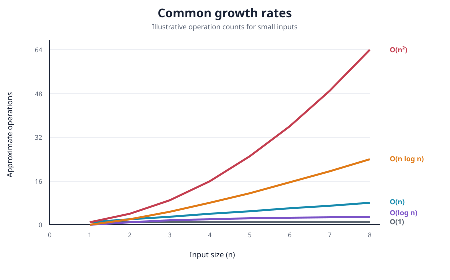
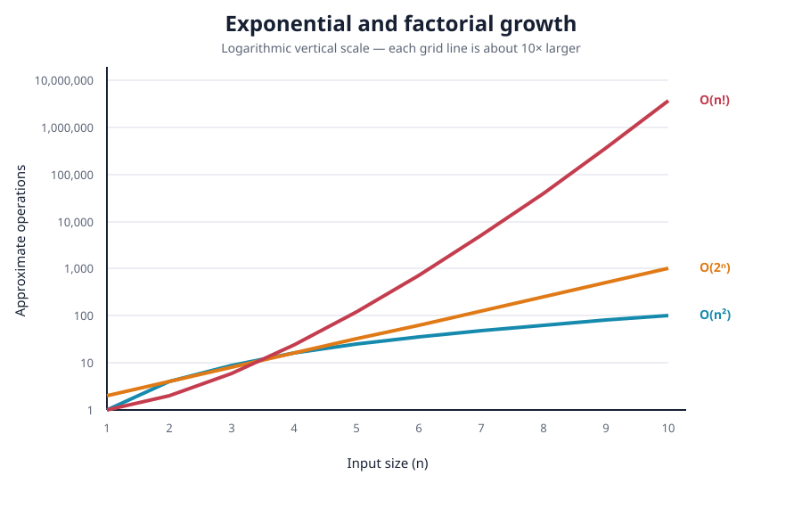

# Big O Notation

Big O describes how an algorithm's resource usage grows as its input grows.
It helps us compare algorithms without depending on a particular computer,
programming language, or exact running time.

For example, suppose one algorithm performs about `n` operations and another
performs about `n²` operations. Both may feel fast when `n = 10`, but the
difference becomes enormous when `n = 1,000,000`.

## What does `n` mean?

`n` represents the size of the input. Its meaning depends on the problem:

- For an array, `n` is usually the number of elements.
- For a string, `n` is usually the number of characters.
- For a matrix, the dimensions might be `rows` and `columns`.
- For a graph, we usually use `V` vertices and `E` edges.

Always define what your variables mean before discussing complexity.

## Time complexity and space complexity

### Time complexity

Time complexity describes how the number of operations grows with the input.
It does **not** mean the exact number of seconds an algorithm takes.

The same program may run faster on a better computer, but its growth pattern
does not change. An `O(n²)` algorithm still grows much faster than an `O(n)`
algorithm.

### Space complexity

Space complexity describes how much additional memory an algorithm uses as
the input grows.

Interviewers often ask for **auxiliary space**, meaning extra space used by
the algorithm, excluding the input itself. Recursion stack frames count as
extra space.

An algorithm may trade memory for speed. For example, a hash map can reduce a
nested search from `O(n²)` time to `O(n)` time while using `O(n)` extra space.

## Big O, Big Omega, and Big Theta

- **Big O — `O(...)`:** an asymptotic upper bound.
- **Big Omega — `Ω(...)`:** an asymptotic lower bound.
- **Big Theta — `Θ(...)`:** a tight bound, both upper and lower.

In interviews, people often use “Big O” informally when discussing the
worst-case running time. Mathematically, Big O means an upper bound and is not
itself another name for “worst case.”

Consider linear search in `[10, 20, 30, 40, 50]`:

- Finding `10` takes one comparison: best case `Θ(1)`.
- Finding `50` takes five comparisons: worst case `Θ(n)`.
- A typical search still grows linearly: average case `Θ(n)`.

State which case you are analyzing when the distinction matters.

## Growth-rate overview

From most scalable to least scalable:

| Complexity | Common name | Typical example |
| --- | --- | --- |
| `O(1)` | Constant | Access an array element by index |
| `O(log n)` | Logarithmic | Binary search in a sorted array |
| `O(n)` | Linear | Scan every array element |
| `O(n log n)` | Linearithmic | Merge sort or heap sort |
| `O(n²)` | Quadratic | Compare every pair of elements |
| `O(2ⁿ)` | Exponential | Try every subset recursively |
| `O(n!)` | Factorial | Try every possible ordering |



The graph uses a small input so the lower growth rates remain visible. It
ignores constants and implementation details, just as asymptotic analysis
does.

Exponential and factorial algorithms become impractical especially quickly:



The second graph uses a logarithmic vertical scale. Each horizontal grid line
represents roughly ten times more operations than the one below it.

## `O(1)` — constant time

The amount of work does not grow with `n`.

```python
def first_item(items: list[int]) -> int:
    return items[0]
```

Accessing one known list index is `O(1)`. The list may contain ten elements or
ten million elements; the operation still directly accesses one position.

Constant time does not have to mean exactly one operation:

```python
def calculate(n: int) -> int:
    doubled = n * 2
    increased = doubled + 10
    return increased
```

This function performs a fixed number of operations, so it is still `O(1)`.

## `O(log n)` — logarithmic time

The algorithm repeatedly removes a fixed fraction of the remaining work.
Binary search removes half of the search range after every comparison.

```text
16 items -> 8 -> 4 -> 2 -> 1
```

Only four reductions are needed to shrink 16 items to one item because
`log₂(16) = 4`.

```python
def binary_search(items: list[int], target: int) -> int:
    left = 0
    right = len(items) - 1

    while left <= right:
        middle = (left + right) // 2

        if items[middle] == target:
            return middle
        if items[middle] < target:
            left = middle + 1
        else:
            right = middle - 1

    return -1
```

Time: `O(log n)`; extra space: `O(1)`.

Binary search requires data that is already sorted. Sorting an unsorted list
first usually costs `O(n log n)`, so sorting only to perform one search may not
be worthwhile.

## `O(n)` — linear time

The work grows in direct proportion to the input size.

```python
def print_items(n: int) -> None:
    for number in range(n):
        print(number)
```

If `n` doubles, the loop performs about twice as much work. Time is `O(n)`.

The following function can return early, but its worst case is still `O(n)`:

```python
def contains(items: list[int], target: int) -> bool:
    for item in items:
        if item == target:
            return True
    return False
```

- Best case: `Θ(1)` when the first item matches.
- Worst case: `Θ(n)` when the item is last or absent.

## `O(n log n)` — linearithmic time

This commonly appears when an algorithm performs `O(log n)` levels of work
and processes `O(n)` values across each level.

Efficient comparison-based sorting algorithms such as merge sort, heap sort,
and Python's Timsort have `O(n log n)` worst-case time.

```text
Level 0:                 n items
Level 1:          n/2              n/2
Level 2:       n/4   n/4        n/4   n/4
...                    log n levels
```

Processing `n` total items at each of `log n` levels gives `O(n log n)`.

## `O(n²)` — quadratic time

A nested loop often produces quadratic time when both loops depend on `n`.

```python
def print_pairs(items: list[int]) -> None:
    for first in items:
        for second in items:
            print(first, second)
```

For every one of the `n` outer iterations, the inner loop also runs `n`
times:

```text
n × n = n²
```

At `n = 10`, there are 100 pairs. At `n = 1,000`, there are 1,000,000 pairs.

A nested loop is not automatically `O(n²)`. If the inner loop halves the
problem on every step, the result might be `O(n log n)`. Count how often each
loop actually runs.

## `O(2ⁿ)` and `O(n!)`

These complexities often appear in brute-force recursive solutions.

- `O(2ⁿ)`: every element has two choices, such as include or exclude when
  generating all subsets.
- `O(n!)`: generate every ordering of `n` values, such as all permutations.

Small increases in `n` produce enormous increases in work:

| `n` | `2ⁿ` | `n!` |
| ---: | ---: | ---: |
| 5 | 32 | 120 |
| 10 | 1,024 | 3,628,800 |
| 20 | 1,048,576 | 2,432,902,008,176,640,000 |

Backtracking can still be the correct approach when constraints are small or
when pruning eliminates much of the search space.

## Rules for simplifying complexity

### 1. Drop constants

```python
def print_twice(items: list[int]) -> None:
    for item in items:
        print(item)

    for item in items:
        print(item)
```

The loops perform `n + n = 2n` iterations.

```text
O(2n) -> O(n)
```

Big O focuses on growth. Multiplying `n` by a fixed constant does not change
the growth category.

### 2. Drop non-dominant terms

```python
def print_pairs_then_items(items: list[int]) -> None:
    for first in items:
        for second in items:
            print(first, second)

    for item in items:
        print(item)
```

The total is `O(n² + n)`. As `n` grows, `n²` dominates `n`:

```text
O(n² + n) -> O(n²)
```

### 3. Add sequential work

Separate steps that run one after another are added.

```text
O(n) + O(n) = O(2n) = O(n)
O(n²) + O(n) = O(n²)
```

### 4. Multiply nested work

Work inside other repeated work is multiplied.

```text
n outer iterations × n inner iterations = O(n²)
n iterations × log n work each = O(n log n)
```

### 5. Keep independent inputs separate

```python
def print_two_lists(a: list[int], b: list[int]) -> None:
    for value in a:
        print(value)

    for value in b:
        print(value)
```

If the inputs have unrelated sizes, time is `O(a + b)`, not `O(n)` and not
`O(a × b)`.

If the loops are nested, the sizes multiply:

```python
def print_cross_product(a: list[int], b: list[int]) -> None:
    for first in a:
        for second in b:
            print(first, second)
```

Time is `O(a × b)`.

### 6. Ignore logarithm bases in Big O

`log₂(n)` and `log₁₀(n)` differ only by a constant multiplier, so both simplify
to `O(log n)`.

## Python list operation complexities

Python lists are dynamic arrays. Operations near the end are usually cheap,
while inserting or removing near the beginning requires shifting elements.

| Operation | Time complexity | Reason |
| --- | --- | --- |
| `items[index]` | `O(1)` | Direct index access |
| `items[index] = value` | `O(1)` | Direct index update |
| `len(items)` | `O(1)` | Length is stored |
| `items.append(value)` | Amortized `O(1)` | Occasional resize copies the array |
| `items.pop()` | `O(1)` | Removes the final item |
| `items.insert(0, value)` | `O(n)` | Shifts existing items right |
| `items.pop(0)` | `O(n)` | Shifts remaining items left |
| `value in items` | `O(n)` | May scan the entire list |
| `items.index(value)` | `O(n)` | May scan the entire list |
| `items[start:end]` | `O(k)` | Copies `k` selected items |
| `items.sort()` | `O(n log n)` | Comparison-based sorting |

“Amortized `O(1)`” means one particular append can cost `O(n)` during a resize,
but a long sequence of appends averages to constant time per append.

For efficient insertion and removal at both ends, consider
`collections.deque`.

## Common data-structure complexities

These are typical interview expectations, with important assumptions noted:

| Data structure / operation | Average | Worst case |
| --- | ---: | ---: |
| Hash table lookup (`dict`, `set`) | `O(1)` | `O(n)` |
| Balanced BST search/insert/delete | `O(log n)` | `O(log n)` |
| Unbalanced BST search/insert/delete | `O(log n)` | `O(n)` |
| Binary heap peek | `O(1)` | `O(1)` |
| Binary heap insert/remove | `O(log n)` | `O(log n)` |
| Graph BFS or DFS | `O(V + E)` | `O(V + E)` |

Hash-table operations rely on a good hash distribution. A binary search tree
only guarantees logarithmic operations when it remains balanced.

## Space-complexity examples

### Constant extra space: `O(1)`

```python
def total(items: list[int]) -> int:
    result = 0
    for item in items:
        result += item
    return result
```

Only a fixed number of variables are created, regardless of list size.

### Linear extra space: `O(n)`

```python
def doubled(items: list[int]) -> list[int]:
    return [item * 2 for item in items]
```

The returned list grows with the input, so the extra space is `O(n)`.

### Recursive stack space

```python
def countdown(n: int) -> None:
    if n == 0:
        return
    countdown(n - 1)
```

There are `n` active recursive calls at the deepest point, so time is `O(n)`
and stack space is `O(n)`.

## A reliable interview method

When asked to analyze or improve an algorithm:

1. Define the input-size variables, such as `n`, `V`, and `E`.
2. Explain the straightforward or brute-force approach first.
3. State time and auxiliary-space complexity separately.
4. Identify the expensive repeated work.
5. Optimize using an appropriate structure or technique.
6. Explain the tradeoff introduced by the optimization.
7. Test edge cases and confirm whether the stated complexity still holds.

Example answer:

> The brute-force solution checks every pair, so it uses `O(n²)` time and
> `O(1)` extra space. A hash map lets me check for each complement in average
> `O(1)` time, reducing the solution to `O(n)` time at the cost of `O(n)`
> extra space.

## FAANG-style interview key points

- **Never give complexity without defining the input.** A graph traversal is
  `O(V + E)`, not simply `O(n)`.
- **Give both time and space.** Include output storage and recursion stack if
  the interviewer asks for total space; clarify when giving auxiliary space.
- **Specify average versus worst case.** Hash-map access is average `O(1)` but
  worst-case `O(n)`.
- **Mention amortized costs.** Dynamic-array append is amortized `O(1)`, not a
  guaranteed `O(1)` for every individual append.
- **Do not multiply consecutive loops.** Add consecutive work; multiply nested
  work.
- **Do not automatically call every nested loop `O(n²)`.** Bounds may shrink,
  pointers may move only once overall, or inputs may have different sizes.
- **Two-pointer loops are often `O(n)`.** If each pointer moves across the
  array at most once, the total number of moves is linear even if a `while`
  loop is nested inside another loop.
- **State preconditions.** Binary search is `O(log n)` only when its search
  space supports eliminating half at each step, commonly a sorted array.
- **Watch hidden Python costs.** Slicing copies elements, string concatenation
  in a loop can be costly, `value in list` is linear, and `pop(0)` shifts the
  list.
- **Know the tradeoff.** Faster lookup often requires extra memory, usually a
  hash map or set.
- **Use constraints as clues.** Roughly, larger inputs demand better growth
  rates; exact limits depend on the language and operation costs.
- **Constants still matter in real systems.** Big O compares long-run growth,
  but a simpler algorithm with better constants can win for small inputs.
- **Communicate before coding.** State the approach, justify its complexity,
  and confirm the tradeoffs before implementation.

## Quick memory guide

```text
O(1)       One direct operation
O(log n)   Repeatedly halve the problem
O(n)       Visit each item once
O(n log n) Divide into levels and process all items per level
O(n²)      Compare many or all pairs
O(2ⁿ)      Explore include/exclude choices
O(n!)      Explore every ordering
```

The goal is not merely to memorize this list. Practice explaining **why** an
algorithm has its complexity by counting how often its important operations
can run.
